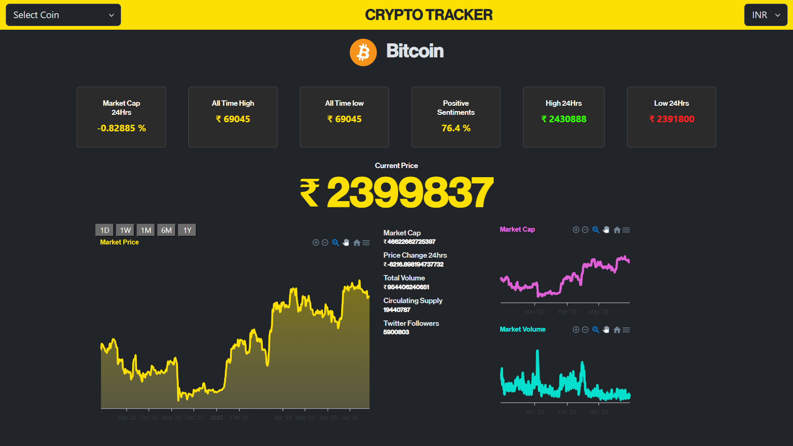

## **Crypto Tracker App**

Cryptocurrency Tracker is a simple web application that allows users to track real-time cryptocurrency prices and market data. Whether you are a crypto enthusiast, investor, or trader, this tool provides you with up-to-date information on various cryptocurrencies, including their prices, market caps, volume, and price changes.

Deployed Link : https://crypto-tracker-swart.vercel.app/

---

## **Screenshots**



---

## **Features**

- Real-time cryptocurrency data
- Search functionality for specific cryptocurrencies
- Detailed information for each cryptocurrency (price, market cap, volume, etc.)
- User-friendly and responsive design
- Intuitive and easy-to-navigate interface

---

## **Tech Stack**

The Crypto Tracker App is built using the following technologies:

- HTML
- CSS
- Javascript
- ReactJS
- Bootstrap
- CoinGecko API
- Apex Charts

---

## **Folder Structure**

The folder structure of the React Weather App is organized as follows:

```
Cryptocurrency-Tracker/
  ├── public/
  │   ├── vite.svg
  ├── src/
  |   ├── Components/
  |   |   ├── CardSection.jsx
  |   |   ├── ChartSection.jsx
  |   |   ├── Header.jsx
  │   ├── App.jsx
  │   ├── App.css
  │   ├── ....
  ├── package.json
  ├── package-lock.json
  ├── README.md

```

---

## **Installation**

To run the Crypto Tracker App locally, follow these steps:

1. Clone the repository:

   ```
   git clone https://github.com/rahulmaurya-exe/Cryptocurrency-Tracker.git
   ```

2. Navigate to the project directory:

   ```
   cd Cryptocurrency-Tracker
   ```

3. Install the dependencies:

   ```
   npm install
   ```

4. Start the development server:

   ```
   npm start
   ```

5. Open your web browser and visit `http://localhost:3000` to access the React Weather App.

---

## **Acknowledgments**

A big thank you to the developers of the [CoinGecko API](https://www.coingecko.com/en/api) for providing the essential data to make this project possible.

---
